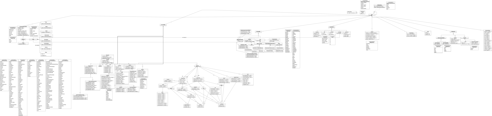
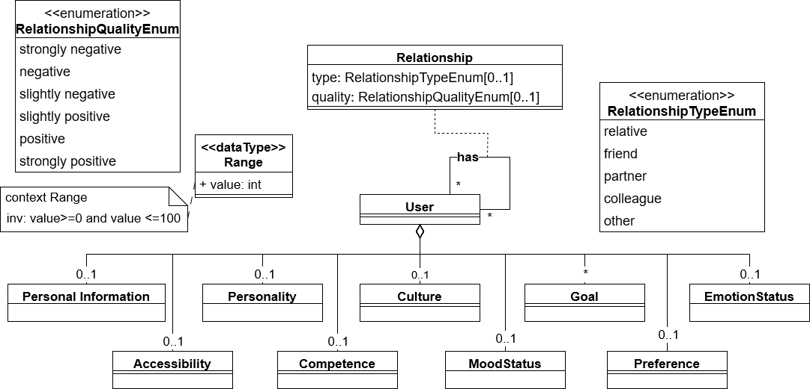

# BESSER-User-Modeling-Language

The BESSER-User-Modeling language provides a unified user modeling language to model users in a comprehensive way, covering numerous user dimensions. 
The complete metamodel is available in multiple formats:
- Editable draw.io version: 
- PNG version of draw.io file: 
- B-UML version: 
- Image of condensed metamodel, providing an overview of the dimension categories: 

The metamodel consists of the following dimension categories: 
- [Personal Information](metamodel/PersonalInformation/)
- [Accessibility](metamodel/Accessibility/)
- [Personality](metamodel/Personality/)
- [Competence](metamodel/Competence/)
- [Culture](metamodel/Culture/)
- [Goal](metamodel/Goal/)
- [MoodStatus](metamodel/MoodStatus/)
- [EmotionStatus](metamodel/EmotionStatus/)
- [Preference](metamodel/Preference/)

## Running the profiled editor frontend and the personalized conversational agent

Information on starting the provided application is available in the [frontend's folder](frontend/).

## References
The modeling language was mainly created based on the results from a systematic literature review on user modeling in model-driven engineering: [User Modeling in Model-Driven Engineering: A Systematic Literature Review](https://arxiv.org/abs/2412.15871).

A concrete mapping of user dimension to reference is available in the individual folders of the dimension categories. 
