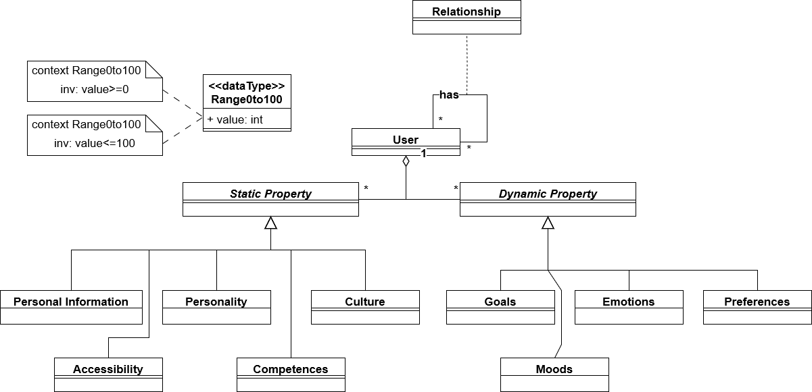

# BESSER-User-Model

The BESSER-User-Model provides a unified and complete user metamodel to represent users and a large array of user dimensions. 

The metamodel consists of the following dimension categories: 
- [Personal Information](metamodel/PersonalInformation/)
- [Accessibility](metamodel/Accessibility/)
- [Personality](metamodel/Personality/)
- [Competences](metamodel/Competences/)
- [Culture](metamodel/Culture/)
- [Goals](metamodel/Goals/)
- [Moods](metamodel/Moods/)
- [Emotions](metamodel/Emotions/)
- [Preferences](metamodel/Preferences/)