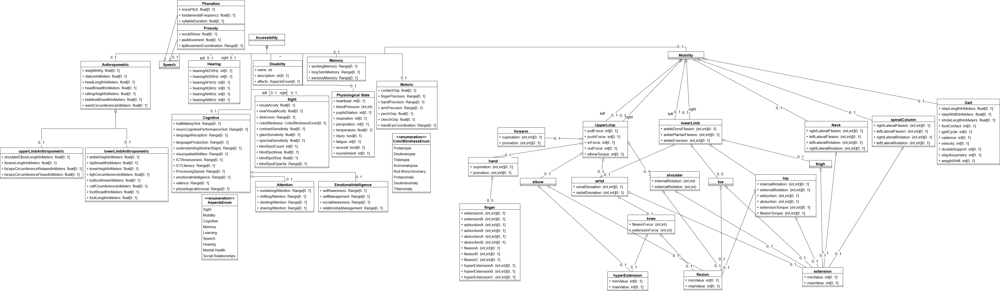

# Accessibility

Accessibility refers to the accessibility needs of the user and everything relating to it.

| Dimension            | Explanation | Reference |
|---------------------|-------------|-----------|
| Anthropometric| Describes the user’s body measurements and proportions, such as height, weight, and limb dimensions, which may influence their accessibility needs (e.g., reachability, ergonomics). | [22] |
| Speech | Represents attributes relating to the user’s ability to produce and articulate speech. | [22]|
| Hearing | Represents attributes relating to the user's hearling levels at different frequencies  |[11] [22]|
| Cognitive | Encompasses cognitive abilities such as memory, attention, problem-solving, and information processing, which may affect how users interact with digital and physical environments. | [6] [22]|
| Sight | Refers to the user’s visual capabilities. | [6] [11] [12] [22]|
| Disability | Describes a concrete disability a user might have | [6] [7] [14] [21] [22] [23]|
| Memory | Represents the user’s ability to retain and recall information, including short-term and long-term memory functions. | [6] [20] [22] |
|PhysiologicalState | Describes temporary or chronic conditions affecting the user’s physical well-being, such as fatigue. | [20] |
|Motoric | Captures fine and gross motor skills, including dexterity, coordination, and muscle controls. |  [6] [11]|
| Mobility | Represents the user’s ability to move independently, including precise information on the different limbs of the user. | [11] [12] |

## References from SLR

| Reference(s)  Number     | Reference |
|--------------------------|-----------|
| 1  | Jason Jaskolka and Brahim Hamid. 2023. Towards the Integration of Human Factors in Collaborative Decision Making for Secure Architecture Design. In Proceedings of the 37th IEEE/ACM International Conference on Automated Software Engineering (ASE '22). Association for Computing Machinery, New York, NY, USA, Article 224, 1–8. https://doi.org/10.1145/3551349.3561149 |
| 2  | Chiraz El Hog, Raoudha Ben Djemaa, and Ikram Amous. 2012. Profile annotation for adaptable Web Service description. In Proceedings of the 27th Annual ACM Symposium on Applied Computing (SAC '12). Association for Computing Machinery, New York, NY, USA, 1935–1940. https://doi.org/10.1145/2245276.2232096 |
| 3  | M. Brambilla and C. Tziviskou, "Modeling Ontology-Driven Personalization of Web Contents," 2008 Eighth International Conference on Web Engineering, Yorktown Heights, NJ, USA, 2008, pp. 247-260, doi: 10.1109/ICWE.2008.44. |
| 4  | Z. Aarab, R. Saidi and M. D. Rahmani, "Event-driven modeling for context-aware information systems," 2016 IEEE/ACS 13th International Conference of Computer Systems and Applications (AICCSA), Agadir, Morocco, 2016, pp. 1-8, doi: 10.1109/AICCSA.2016.7945785.|
| 5  | Martin Wischenbart, Stefan Mitsch, Elisabeth Kapsammer, Angelika Kusel, Birgit Pröll, Werner Retschitzegger, Wieland Schwinger, Johannes Schönböck, Manuel Wimmer, and Stephan Lechner. 2012. User profile integration made easy: model-driven extraction and transformation of social network schemas. In Proceedings of the 21st International Conference on World Wide Web (WWW '12 Companion). Association for Computing Machinery, New York, NY, USA, 939–948. https://doi.org/10.1145/2187980.2188227 |
| 6  | Jovanovic, M., Starcevic, D., Jovanovic, Z. (2014). Bridging User Context and Design Models to Build Adaptive User Interfaces. In: Sauer, S., Bogdan, C., Forbrig, P., Bernhaupt, R., Winckler, M. (eds) Human-Centered Software Engineering. HCSE 2014. Lecture Notes in Computer Science, vol 8742. Springer, Berlin, Heidelberg. https://doi.org/10.1007/978-3-662-44811-3_3 |
| 7  | Kennedy, Grace & Scott, William & Shirvani, Farid & Campbell, Allan. (2020). Managing Organisational System Evolution Through Model-Based Systems Engineering Approaches. 10.1109/SysCon47679.2020.9275920.  |
| 8  | Vázquez-Ingelmo, A., García-Peñalvo, F. J., Therón, R., & Conde, M. Á. (2020). Representing Data Visualization Goals and Tasks through Meta-Modeling to Tailor Information Dashboards. Applied Sciences, 10(7), 2306. https://doi.org/10.3390/app10072306  |
| 9  | Khider, H., Hammoudi, S., & Meziane, A. (2020). Business Process Model Recommendation as a Transformation Process in MDE: Conceptualization and First Experiments. International Conference on Model-Driven Engineering and Software Development. |
| 10  | Irene Garrigós, Jesús Pardillo, Jose-Norberto Mazón, Jose Zubcoff, Juan Trujillo, and Rafael Romero. 2012. A Conceptual Modeling Personalization Framework for OLAP. J. Database Manage. 23, 4 (October 2012), 1–16. https://doi.org/10.4018/jdm.2012100101|
| 11  | Silva, S., Belo, O. (2023). Domain and Semantic Modeling in the Context of Interactive Systems Development: User and Device Cases. In: Papadaki, M., Rupino da Cunha, P., Themistocleous, M., Christodoulou, K. (eds) Information Systems. EMCIS 2022. Lecture Notes in Business Information Processing, vol 464. Springer, Cham. https://doi.org/10.1007/978-3-031-30694-5_36 |
| 12  | Yigitbas, E., Jovanovikj, I., Biermeier, K. et al. Integrated model-driven development of self-adaptive user interfaces. Softw Syst Model 19, 1057–1081 (2020). https://doi.org/10.1007/s10270-020-00777-7 |
| 13  | Karam, R., Fraternali, P., Bozzon, A., Galli, L. (2012). Modeling End-Users as Contributors in Human Computation Applications. In: Abelló, A., Bellatreche, L., Benatallah, B. (eds) Model and Data Engineering. MEDI 2012. Lecture Notes in Computer Science, vol 7602. Springer, Berlin, Heidelberg. https://doi.org/10.1007/978-3-642-33609-6_3 |
| 14  |Gaspar, A., Gil, M., Panach, J.I. et al. Towards a general user model to develop intelligent user interfaces. Multimed Tools Appl 83, 67501–67534 (2024). https://doi.org/10.1007/s11042-024-18240-w|
| 15  | Sofiane Abbar, Mokrane Bouzeghoub, and Stéphane Lopes. 2010. Introducing contexts into personalized web applications. In Proceedings of the 12th International Conference on Information Integration and Web-based Applications & Services (iiWAS '10). Association for Computing Machinery, New York, NY, USA, 155–162. https://doi.org/10.1145/1967486.1967513 |
| 16  | Hourieh Khalajzadeh, John Grundy, and Jennifer McIntosh. 2022. Vision: developing collaborative model-driven apps for personalised care plans. In Proceedings of the 25th International Conference on Model Driven Engineering Languages and Systems: Companion Proceedings (MODELS '22). Association for Computing Machinery, New York, NY, USA, 929–933. https://doi.org/10.1145/3550356.3559100 |
| 17  | Ingrid Nunes, Simone D.J. Barbosa, Don Cowan, Simon Miles, Michael Luck, Carlos J.P. de Lucena, Natural Language-based Representation of User Preferences, Interacting with Computers, Volume 27, Issue 2, March 2015, Pages 133–158, https://doi.org/10.1093/iwc/iwt060 |
| 18  | I. Elmagrouni, M. Lethrech, A. Kenzi and A. Kriouile, "Approach for building Services-Oriented systems adaptable," 2016 5th International Conference on Multimedia Computing and Systems (ICMCS), Marrakech, Morocco, 2016, pp. 183-188, doi: 10.1109/ICMCS.2016.7905656. |
| 19  |Paul Perrotin, Salah Sadou, David Hairion, and Antoine Beugnard. 2020. Detecting human vulnerably in socio-technical systems: a naval case study. In Proceedings of the 23rd ACM/IEEE International Conference on Model Driven Engineering Languages and Systems: Companion Proceedings (MODELS '20). Association for Computing Machinery, New York, NY, USA, Article 56, 1–8. https://doi.org/10.1145/3417990.3420045 |
| 20 | Sheikh Bahaei, Soheila & Gallina, Barbara. (2021). A Metamodel Extension to Capture Post Normal Accidents in AR-equipped Socio-technical Systems. 768-775. 10.3850/978-981-18-2016-8_417-cd. |
| 21 | A. Ben Cheikh, S. Coulondre, A. Front and J. -P. Giraudin, "An engineering method for context-aware and reactive systems," 2012 Sixth International Conference on Research Challenges in Information Science (RCIS), Valencia, Spain, 2012, pp. 1-12, doi: 10.1109/RCIS.2012.6240433.|
| 22  | Kaklanis, N., Biswas, P., Mohamad, Y. et al. Towards standardisation of user models for simulation and adaptation purposes. Univ Access Inf Soc 15, 21–48 (2016). https://doi.org/10.1007/s10209-014-0371-2|
| 23  | Orellana, Douglas & Madni, Azad. (2014). Human System Integration Ontology: Enhancing Model Based Systems Engineering to Evaluate Human-System Performance. Procedia Computer Science. 10.1016/j.procs.2014.03.003. |
| 24  | Jaouadi, I., Ben Djemaa, R. & Ben-Abdallah, H. A model-driven development approach for context-aware systems. Softw Syst Model 17, 1169–1195 (2018). https://doi.org/10.1007/s10270-016-0550-0|
| 25  | V. G. Motti and J. Vanderdonckt, "A computational framework for context-aware adaptation of user interfaces," IEEE 7th International Conference on Research Challenges in Information Science (RCIS), Paris, France, 2013, pp. 1-12, doi: 10.1109/RCIS.2013.6577709.|
| 26  | Tapucu, Dilek & Can, Ozgu & Bursa, Okan & Unalir, Murat. (2008). Metamodeling Approach to Preference Management in the Semantic Web. AAAI Workshop - Technical Report. |
| 27  | J. Bocanegra, J. Pavlich-Mariscal and A. Carrillo-Ramos, "DMLAS: A Domain-Specific Language for designing adaptive systems," 2015 10th Computing Colombian Conference (10CCC), Bogota, Colombia, 2015, pp. 47-54, doi: 10.1109/ColumbianCC.2015.7333411.|

## Additional References

| Reference(s)  Number     | Reference |
|--------------------------|-----------|
| 28| Heckmann, Dominik. (2006). Ubiquitous User Modeling. |
| 29 |Park, J. S., Zou, C. Q., Shaw, A., Hill, B. M., Cai, C., Morris, M. R., ... & Bernstein, M. S. (2024). Generative agent simulations of 1,000 people. arXiv preprint arXiv:2411.10109 |