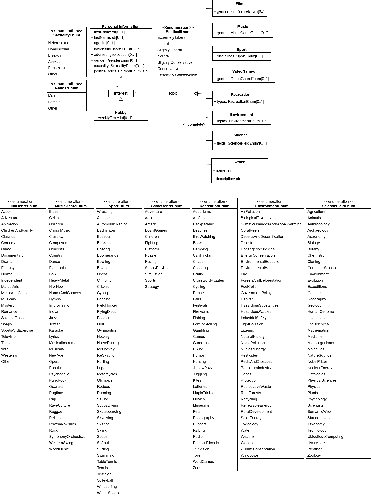

# Personal Information

Personal information describes typical information a user would enter on a profile page as part of a social media platform or similar to complete their identity. 

| Dimension   | Explanation                                   | Reference(s) Number      |
|------------|------------------------------------------------|--------------------------|
| firstName  | First name(s) of the user. |      [1]  |
| lastName  | Last name(s) of the user.    |  |
| age  | Age of the user. |        |
| nationality_iso3166  | Nationalities of the user using the iso3166 country codes.|       |
| address  | Living address of the user. |       |
| gender  | Gender the user identifies themselves with. |      |
| sexuality  | Sexuality of the user. |        |
| politicalBelief  | Political beliefs of user, ranging from strongly liberal (progressive policies, government intervention) to strongly conservative (traditional values, limited government). |        |

| Reference(s)  Number     | Reference |
|--------------------------|-----------|
| 1  | Chiraz El Hog, Raoudha Ben Djemaa, and Ikram Amous. 2012. Profile annotation for adaptable Web Service description. In Proceedings of the 27th Annual ACM Symposium on Applied Computing (SAC '12). Association for Computing Machinery, New York, NY, USA, 1935–1940. https://doi.org/10.1145/2245276.2232096
| 2  | 
| 3  | 
| 4  | 
| 5  | 
| 6  |
| 7  | 
| 8  | 